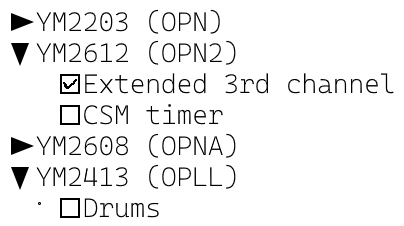

# What to do next idk

Note: whatever feature/fix made by tildearrow, if useful, are ported to this fork.

Remove:
- Deflemask compatibility with exporting modules and no longer add new compatibility flags (you can still import modules)
- Basic mode
- Tutorial
- Cheat codes (cringe)
- Intro (cringe)
- Long codebase problems and other jank that never was fully implemented
- The clutter of tons of chip entries (see below)
- Limit of 128 channels and 32 chips. Memory for channels and chips must be dynamically allocated
- Some arcade presets (too many of them)
- Panic attacks measures, like saving 5 copies of config files and backup modules

Change:
- Make instrument fields a dynamically allocated memory, including the special macros. Thus each instrument would have a handful of pointers inside instead of a big pile of special structs cluttering the memory. Thus you can have tons of macros if the chip needs it but only a handful of macros if it’s some simple chip.
- Finish the damn FamiTracker import jesus
- Make the damn chip description to scroll if it’s too long
- Allow to dynamically load samples into chip’s memory if possible during song playback
- Reorganize the chips menu. There is a separate menu for chips and systems (which contain multiple chips inside; also called “compound systems”). In chips menu, features such as e.g. extended 3rd channel and CSM timer are selectable: 

These can be enabled or disabled (in this case a backup is made) later, and notes are shifted onto their respective new patterns (if applicable).

Add:
- Full FamiTracker import (including E-FamiTracker)
- Import of the following: “xm”, “it”, "med", "s3m", "mptm", "a2m", "rmt", “vt” (Vortex Tracker), “sng” (GoatTracker)
- Local wavetables and samples inside each instrument with a switch so sample map/wavetable selection macro refers to local or global waves
- DPCM loop point
- Chips from pending Furnace PRs, if possible (right now it’s OPL4, MultiPCM, ESFM, ES5503)
- Features from pending Furnace PRs, if possible
- Ability to copy-paste LFO and ADSR type macros
- Instrument preview on instrument load
- Slowly add any other chips when enough info about them is gathered and decent emulators are made (debatable if some borderline chips are in question like various DSP processors or SCSP)
- Ability to paste a pack of wavetables like the one Kurumi wavetable builder produces
- Investigate feature requests present on Github Discussions. For example, YM2413 PCM, SN76489 Snooze Tracker-like features, AY-3-8910 PWM.
- OPF2 sound chip (and other fantasy sound sources like YM2609)
- Saving “Appearance” tab setting in color+interface config file

Misc
- When designing a hardware playback driver, make it modular. E.g. if no vibrato is used, cut out the assembly code that renders the vibrato. If no filter control is present, cut out that part. And so on. Thus the driver can be big and slow if the song uses some advanced features, but small and fast if the user wrote a simple piece of music. Ideally emulator has an unrolled loop for all channels (if makes a big difference, so applicable only to low-spec system), and these features can be included into the code of specific channel (based on if the feature is used by that channel throughout the song). Thus even better modularity can be achieved.
- Have an open approach to driver donation from the community and disassemblies. Invite members that have already designed their own routines.
- Analyze chips that were implemented with emulation in a very HLE way (biggest offender: Game.com’s noise LFSR).
- Debate on Follin-like ZX Spectrum beeper engine from hardware-export view (likely, replace with existing drivers like Octode or QChan)
- If the project goes overboard, consider the age-old dilemma of changing the name.
- Try to come up with a way to enable multi-language support
- Wavetable editor as powerful as Kurumi (at least Kurumi 3)
